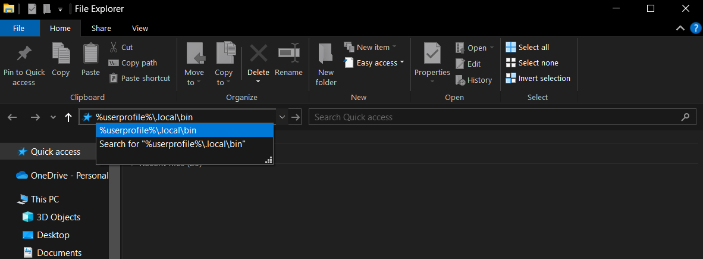

# pytube-gui


A graphical application for interacting with [pytube](https://github.com/pytube/pytube).

## Features

### Downloading a video

Simply select the "Video" option, copy-paste the URL, and click "Start".

### Downloading a playlist

Select the "Playlist" option and copy-paste the URL. You can choose to download the entire playlist
or a range of videos in the playlist. Note that videos that are private, not available, etc. are ignored.

### Downloading audio only

Check the "Audio only" checkbox to download the video or playlist as `.mp3` files.

## Installation
### Prerequisites
- Python 3.8+

### Via pipx 
It is generally recommended to isolate Python applications from each other.
[Pipx](https://github.com/pypa/pipx) is recommended for easily creating Python 
virtual environments and creating executables to run.

If you already have `pipx` installed and working, you can install `pytube-gui` 
with this command:
```
pipx install git+https://github.com/WillChamness/pytube-gui
```

If you're using Windows, `pipx` does not create a link to the the desktop by default. 
To create a link to the desktop in Windows 10, follow these steps:

1. Open file explorer
2. Enter the following and click `%userprofile%\.local\bin`:

3. Right click `pytube-gui.exe`
4. Hover over `Send to` and click `Desktop (create shortcut)`
5. Rename the desktop link to `Pytube GUI`

### Via Python venv
If you want to run the application in an isolated environment but don't want to use 
`pipx`, you can install it using `python-venv`. Clone this repo with `git` or 
download the code directly from Github and run these commands in your preferred
terminal/shell:
```
python -m venv env || python3 -m venv env
source env/bin/activate || env\Scripts\activate
pip install -r requirements.txt
```

To run the application from a fresh terminal instance, use these commands:
```
source env/bin/activate || env\Scripts\activate
python run.py || python3 run.py
```

### Via pip globally (not recommended)
It is not recommended to install applications globally via `pip` as updates 
to dependencies may break various applications. Furthermore, some package
managers install Python modules to the same location as `pip`, causing breakage 
between the two. However, you can still install globally if you want. Simply
type this command in a terminal:
```
pip install git+https://github.com/WillChamness/pytube-gui
```
Note that some Linux distributions may require more work to globally install 
Python applications with `pip`.
