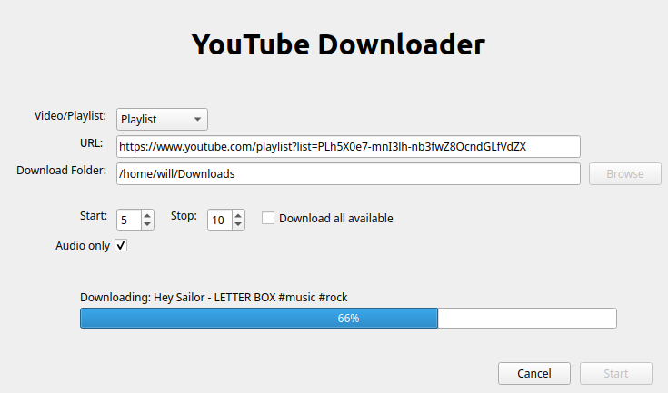

# pytube-gui

A graphical application for interacting with [pytube](https://github.com/pytube/pytube).

## Features

### Downloading a video

Simply select the "Video" option, copy-paste the URL, and click "Start".

### Downloading a playlist

Select the "Playlist" option and copy-paste the URL. You can choose to download the entire playlist
or a range of videos in the playlist. Note that videos that are private, not available, etc. are ignored.

### Downloading audio only

Check the "Audio only" checkbox to download the video or playlist as `.mp3` files.
